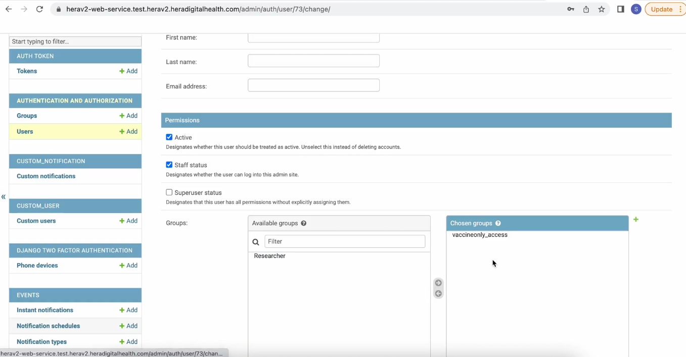
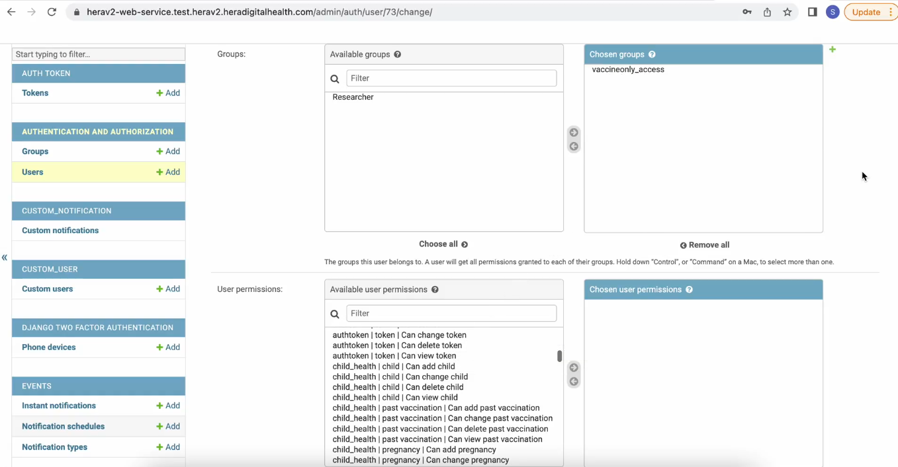

# 12: How to give users restricted access to admin panel

## **The admin panel:**

Our web based interface that contains the dashboard for site and user management

**User Management**

To manage users, navigate to the **Authentication and Authorization** tab. Within this section, you will find two primary categories: **Groups** and **Users**.

- **Groups**: Used to manage and organize users based on their roles and permissions. Groups simplify the process of assigning and updating access levels for multiple users simultaneously. \

- **Users**: Used to manage individual user accounts. This includes creating, editing, and deleting user profiles, as well as assigning users to specific groups. \

## Step 1 Click on the Groups Tab

The **Groups** tab provides a centralized view of all available permissions, such as adding, removing, changing, and modifying vaccines, immunizations, and other relevant data. By adhering to the principle of least privilege, you can assign the minimum necessary permissions to users, ensuring a secure and efficient management process.

### To create groups

Step 1:

- **Select Relevant Permissions**: Choose all the necessary permissions from the available options.

- **Name the Group**: Assign a descriptive name to the group.

- **Transfer Permissions**: Move the selected permissions from the "Available Permissions" list to the "Chosen Permissions" list and click **Save**

### Successful group Creation

##

## Step 2 Creating a User

1. **Navigate to the Authentication and Authorization Tab**: Click on the "Add User" button.

2. **Enter User Details**: Provide a username and a temporary password for the user.

1. **Select Relevant Group**: Choose the group that contains the appropriate permissions.

2. **Set Staff Status: **Ensure the user is designated as "Staff" so they can log into the dashboard

3. **Transfer group**: Move the group permissions from the "Available Groups" list to the "Chosen Group" list. And scroll to the bottom and save.

**Set Custom Permissions**: You can manually assign individual permissions, but this can be tedious if you have a large number of users

## **User Login**:

**User Access**

The user can now access the dashboard. Based on the assigned permissions, they will only be able to access the resources and functionalities permitted to them.

For example, _NurseSu_ will only have access to the vaccines section, as per the permissions assigned.

*NurseSu *will only have access to the vaccines section, that can even allow them to edit, add or remove vaccines as per the permissions assigned.

