# 3: How to add, edit and delete vaccines

## The pregnancy and Child health tab, click vaccines

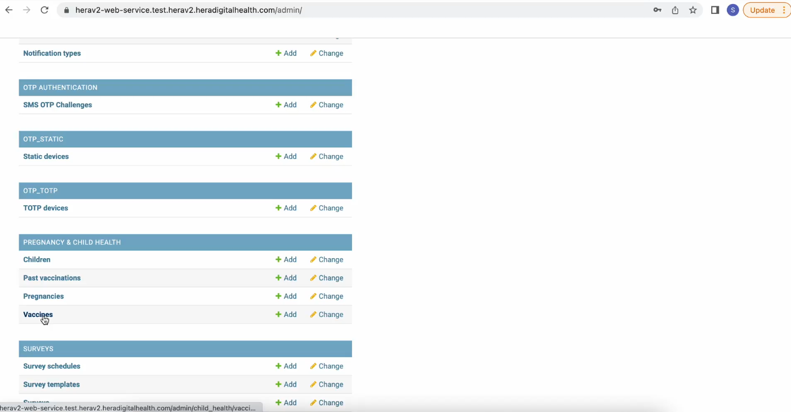

## The next page will give you all the available vaccines in the app

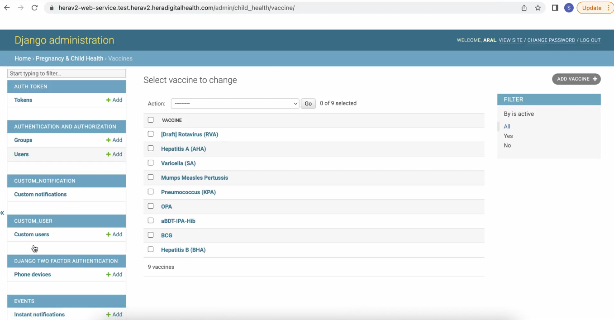

When you click on a vaccine, a new page will appear with various options:

1. **Vaccine Name**: The name of the vaccine.

2. **Gender**: You specify whether the vaccine is for female or male only or both genders. Select the appropriate option based on the recommended gender.

3. **Active Status**: Indicate whether the vaccine is active. If the "Active" button is selected, the vaccine will appear on the app; otherwise, it will not.

4. **Dose Information**: In the lower tab, provide details about the doses, including:

- **Dose Name**: e.g., Dose 1, Dose 2.

- **Administration Schedule**: Specify the number of weeks each dose is supposed to be administered.

- **Notes to Parents**: Include any important notes or instructions for parents.

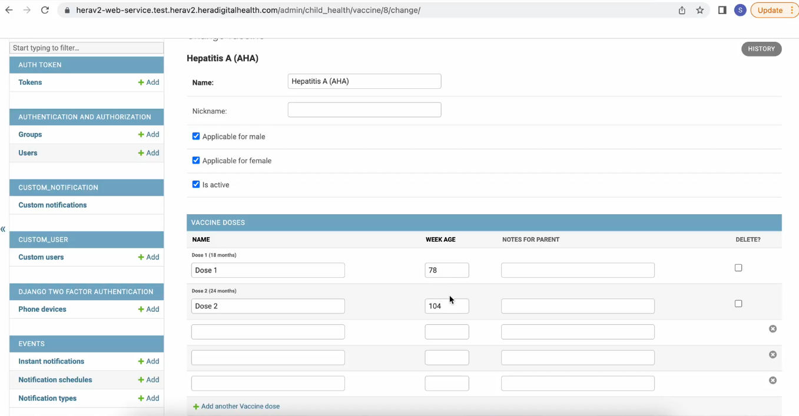

## To add a new vaccine

### Adding a vaccine to the dashboard

1. **Navigate to the Pregnancy and Child Health Tab**: From the left side menu, scroll to the "Pregnancy and Child Health" tab.

2. **Access the Vaccines Section**: Click on "Vaccines."

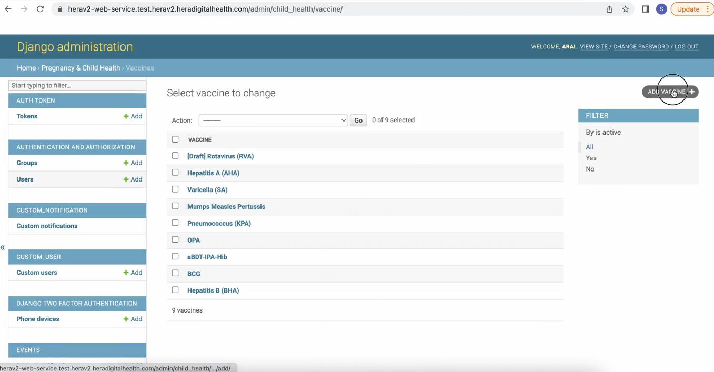

At the new page

- **Name**: Write the full name of the vaccine.

- **Nickname**: Provide a nickname for the vaccine. The nickname can be used to quickly search for the vaccine without having to type out its full name.

- **Active: **Indicate if dose is active for it to be visible at the app

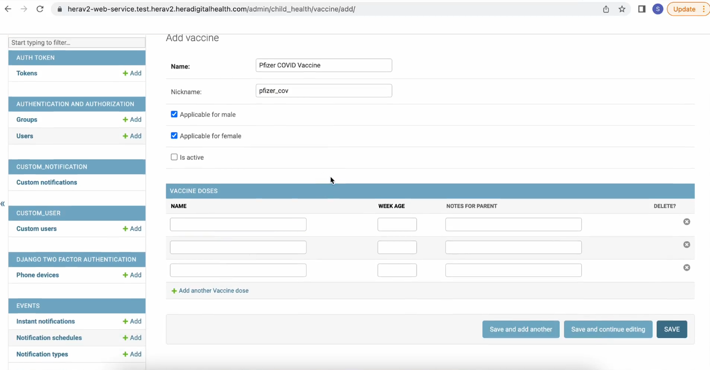

1.  **Enter Dosage Details**:

- **Dose Name**: Provide a name for the vaccine dose (e.g., Dose 1, Dose 2).

- **Administration Schedule**: Specify after how many weeks the vaccine should be administered.

**Save**: Click the "Save" button to record the dosage information.

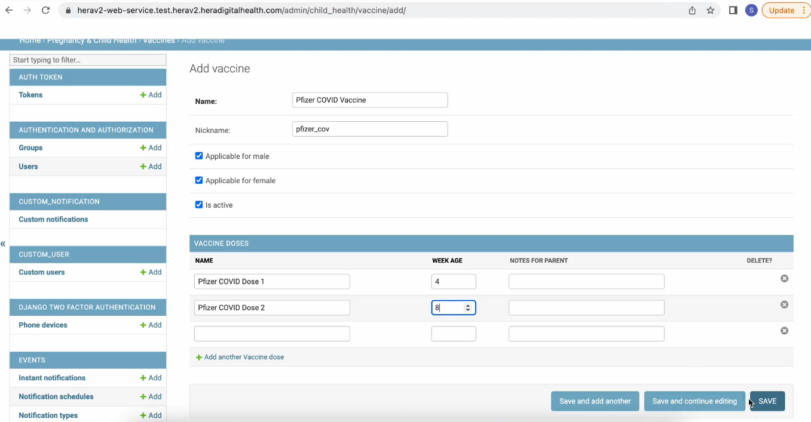

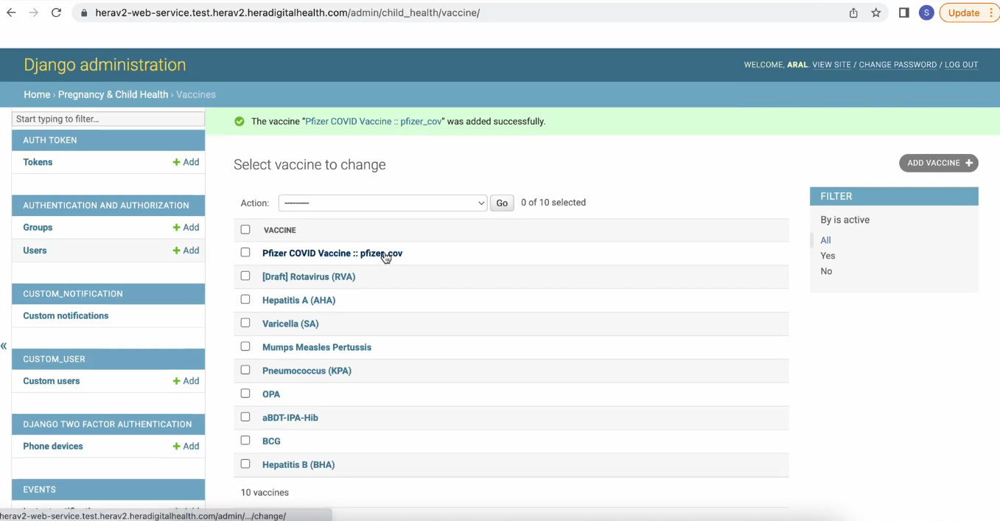

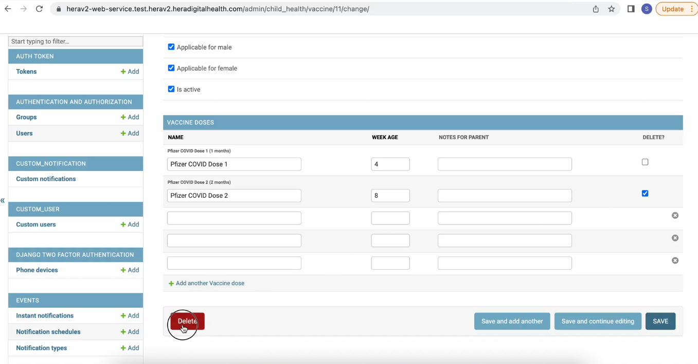

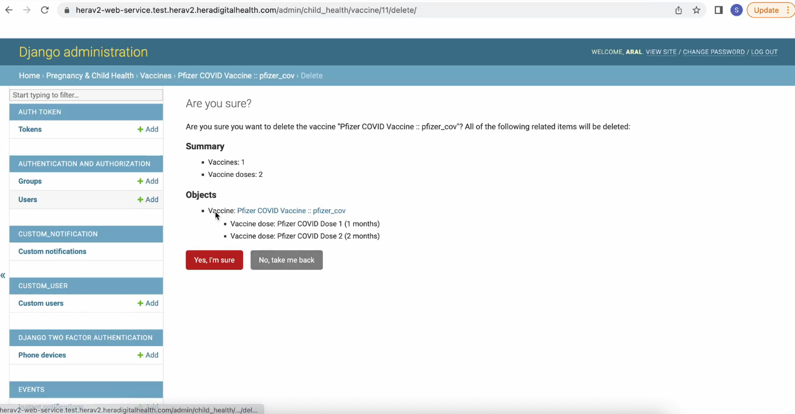

Saving Options

After entering the vaccine details, you have three saving options to choose from:

1. **Save and Add Another**: This option saves the current vaccine and immediately opens a new form to add another vaccine.

2. **Save and Continue Editing**: This option saves the current vaccine and keeps the form open for further editing.

3. **Save**: This option saves the current vaccine and closes the form.

**Save and Add Another**:

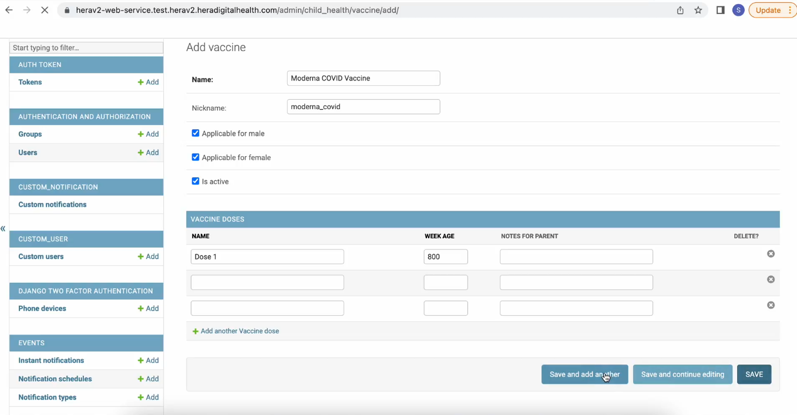

Will immediately switch to another form that will enable you to quickly add another vaccine

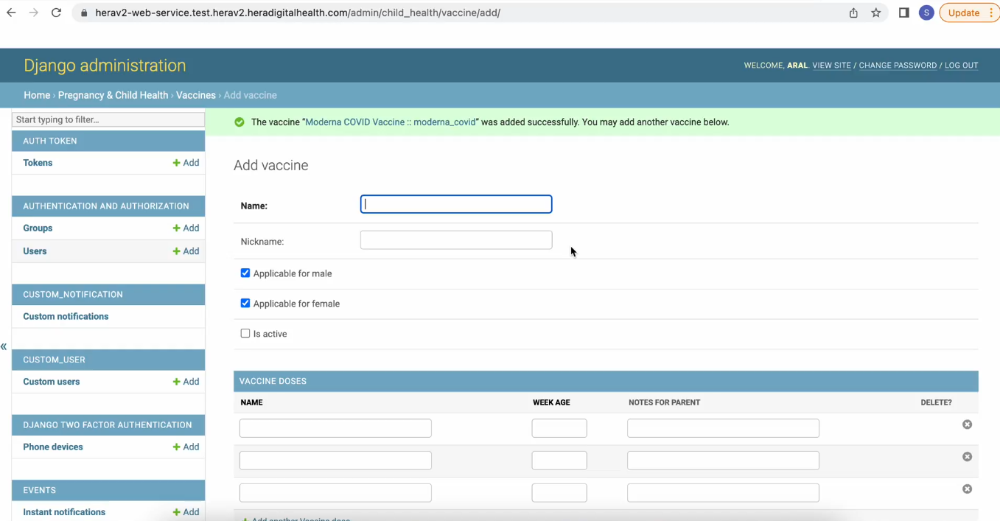

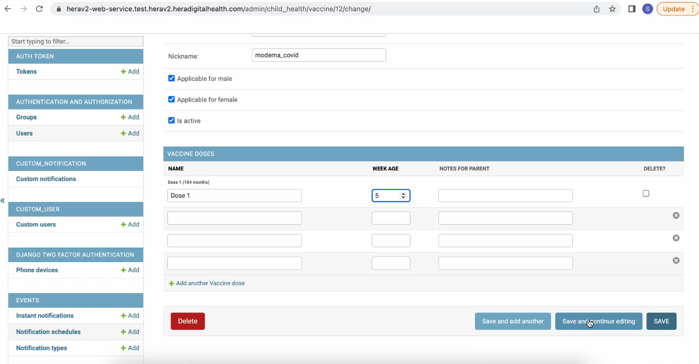

### Active Checkbox

The "Active" checkbox controls the visibility of the vaccine on the app:

- **Checked**: When checked, the vaccine will be displayed on the app.

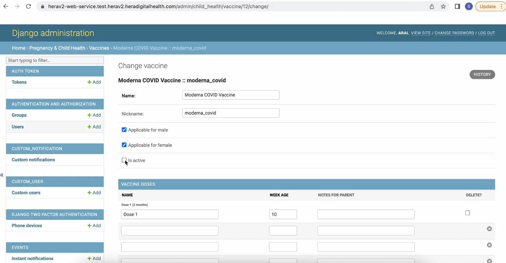

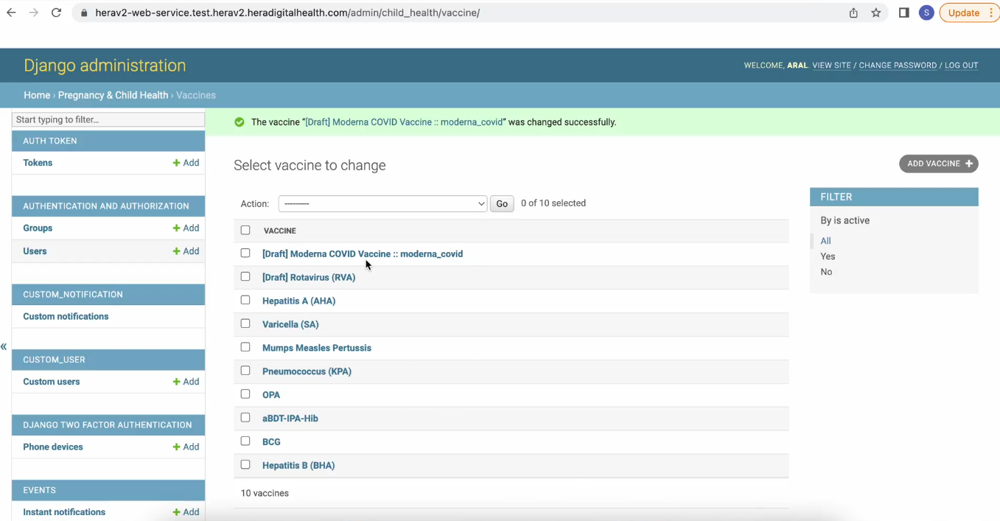

On the right side of the page, you will find the filter option. This allows you to filter the list of vaccines based on the following criteria:

- **Active Vaccines**: Display only the vaccines that are currently active.

- **Non-Active Vaccines (Draft)**: Display only the vaccines that are in draft status.

- **All Vaccines**: Display all vaccines, regardless of their status.

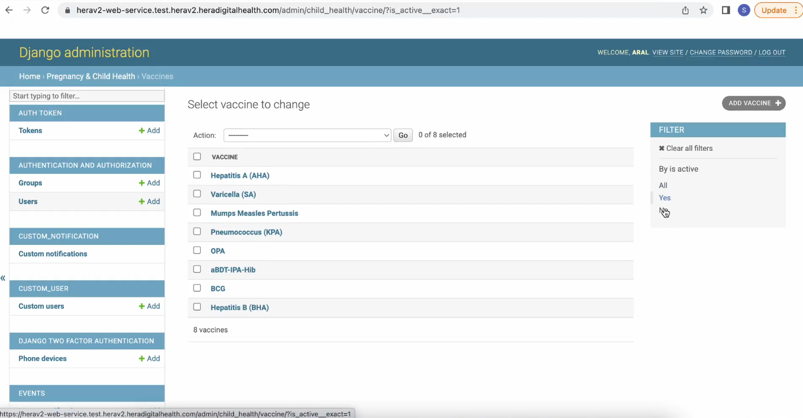

The filter option when active filter no

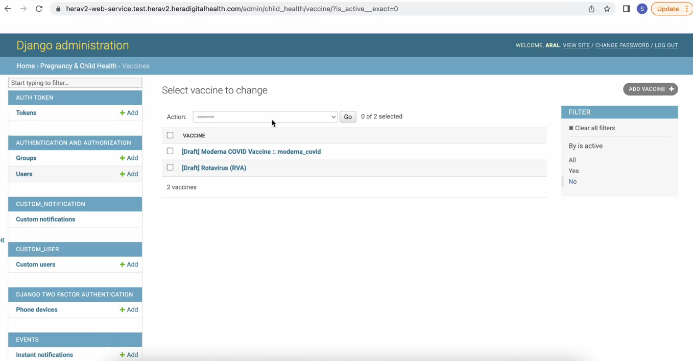
