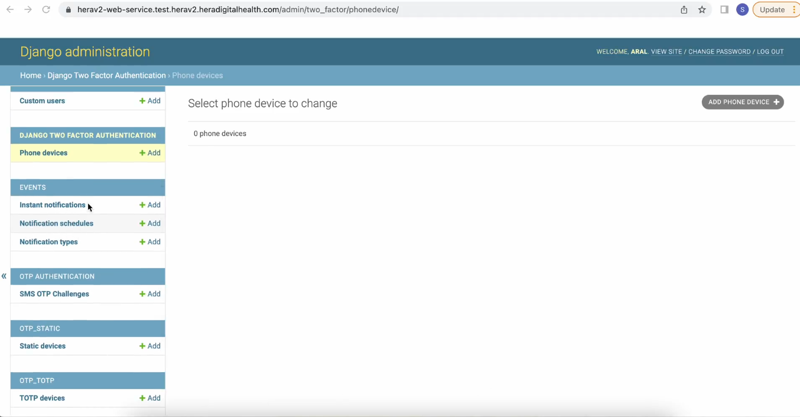
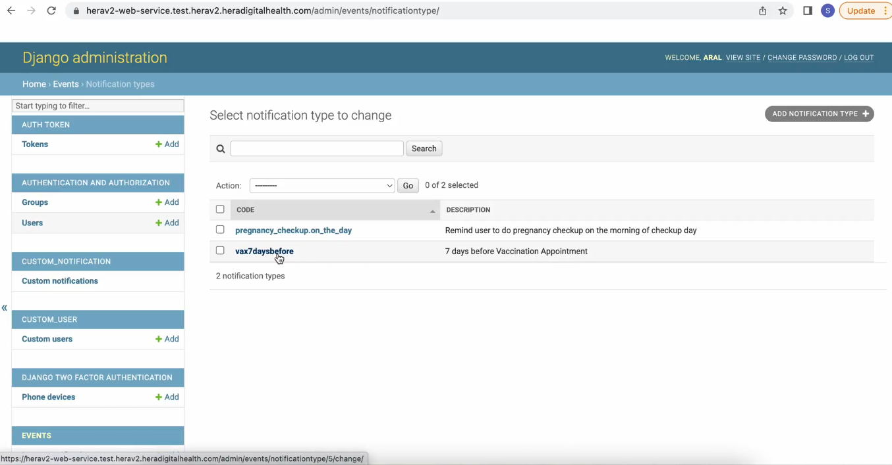
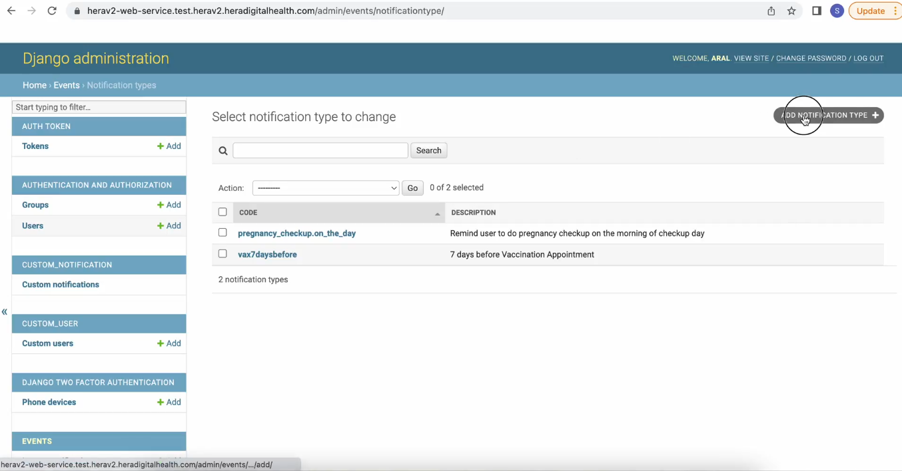
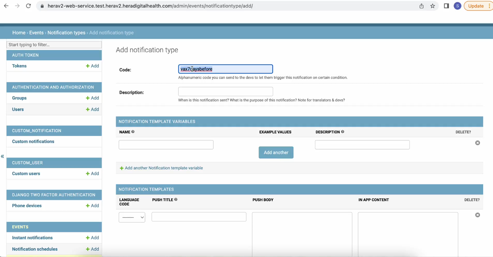
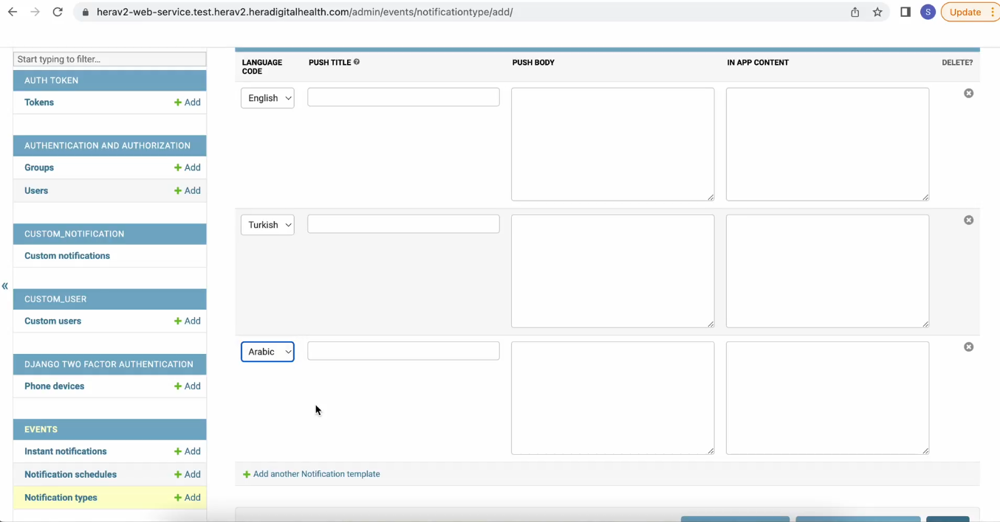
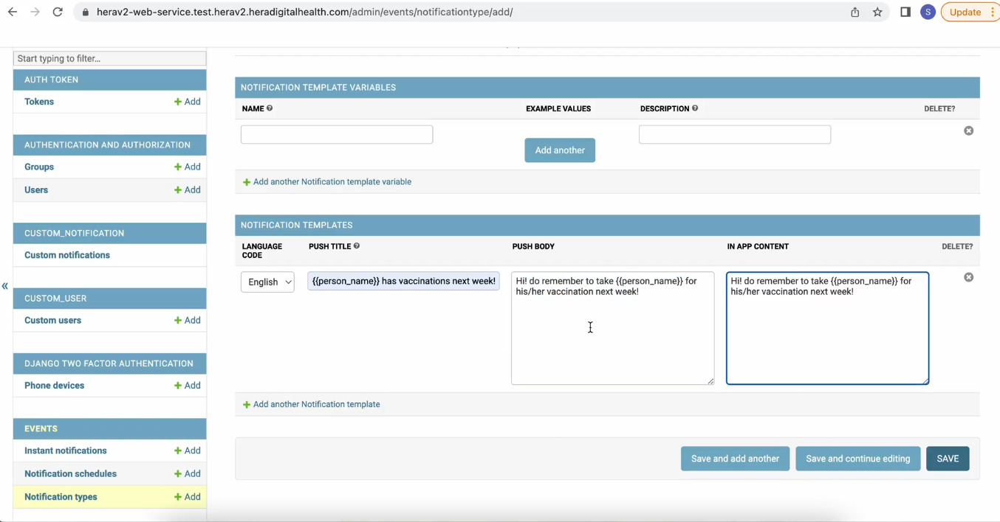
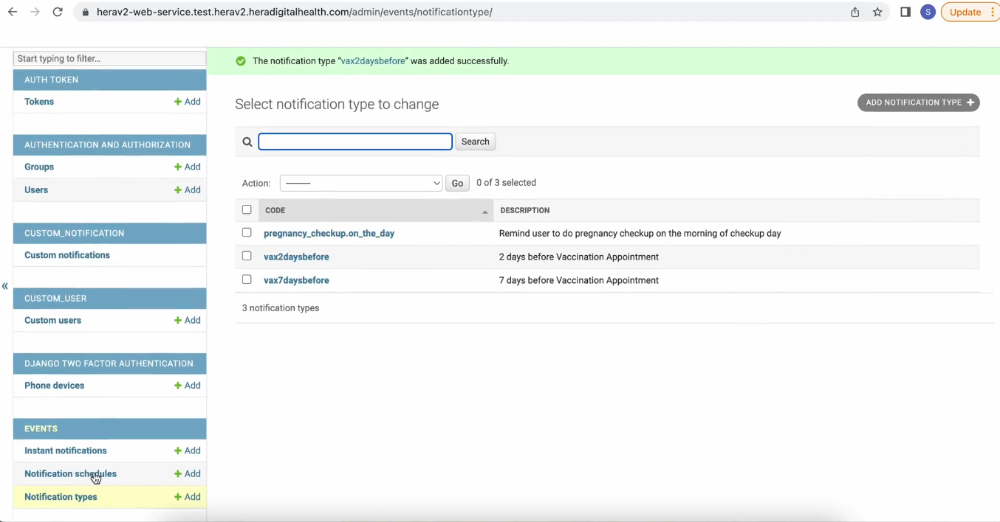
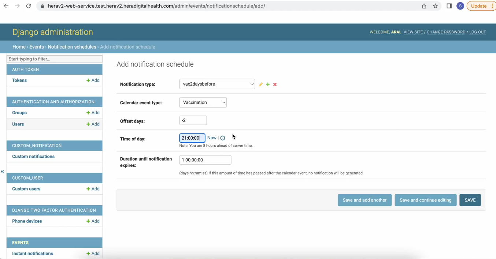
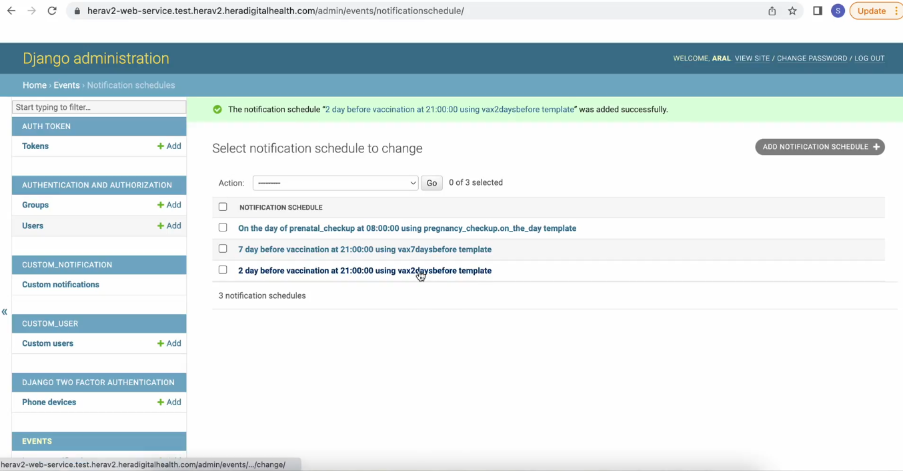

# 4: How to add, edit and delete notifications

#### Navigate to the right-hand side and select the **"Events" tab**. Within this tab, you will find three options: "Instant Notifications," "Notification Schedules," and "Notification Types."

#### To begin, you will need to create a notification type. Click on "Notification Types" to proceed.

#### To **create the notification**, first specify the code (ensuring the name contains no spaces) and input the description of the notification.

#### You can specify the **languages **in which you want users to receive the notification. The message sent will be determined by the language they have set for the app. If the user's selected language is not available, the notification will default to English.

#### In the **Events tab,** you can now edit the notification schedule. To add a new notification schedule, click the button in the upper right-hand corner

### On the Add Notification Schedule page, you will need to specify the following options:

1. **Notification Type**: Select from the notifications you have previously created.

2. **Calendar Event Type**: Choose between "Pregnancy" or "Vaccination."

3. **Offset Days**: Specify the number of days before the scheduled appointment when the notification should be sent. For example, if you set it to -2 days, the notification will be sent 2 days before the appointment.

4. **Time of Day**: Set the time at which the user will receive the message. This time will be synchronized with the user's time zone to ensure they receive the notification at the appropriate time.

### Once you have filled in these details, click "Save."

#### And the new notification schedule would be created

