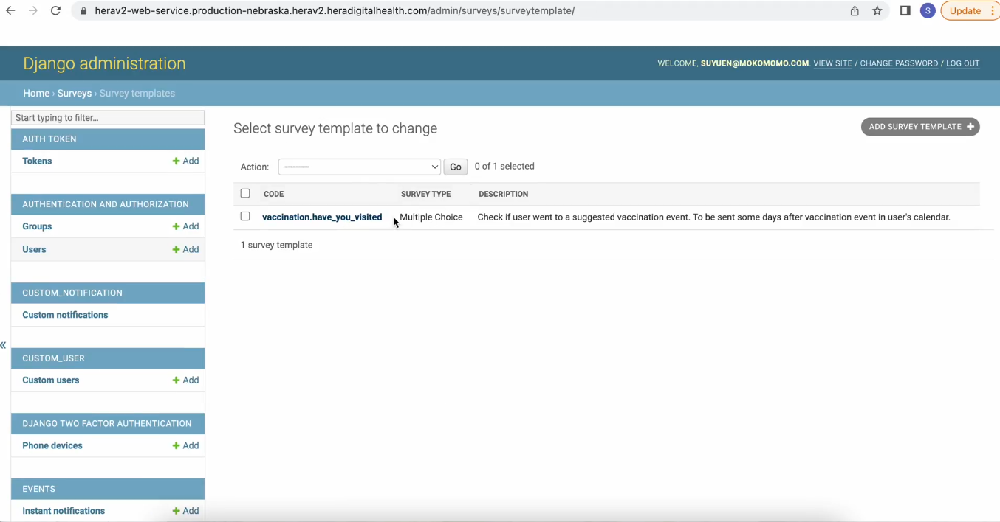
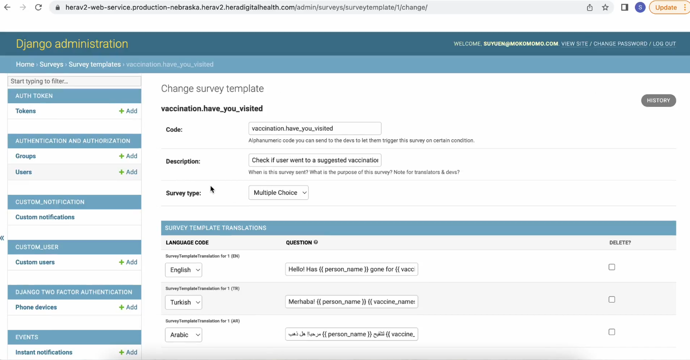
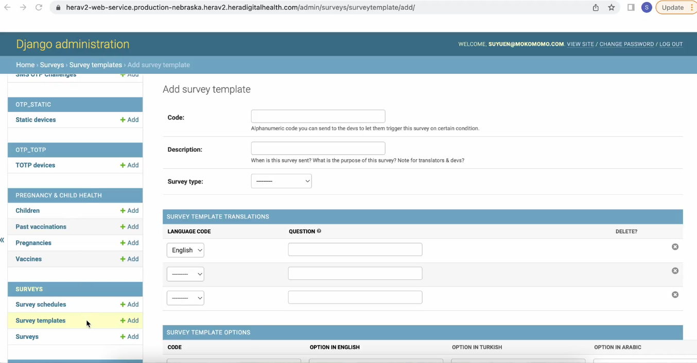
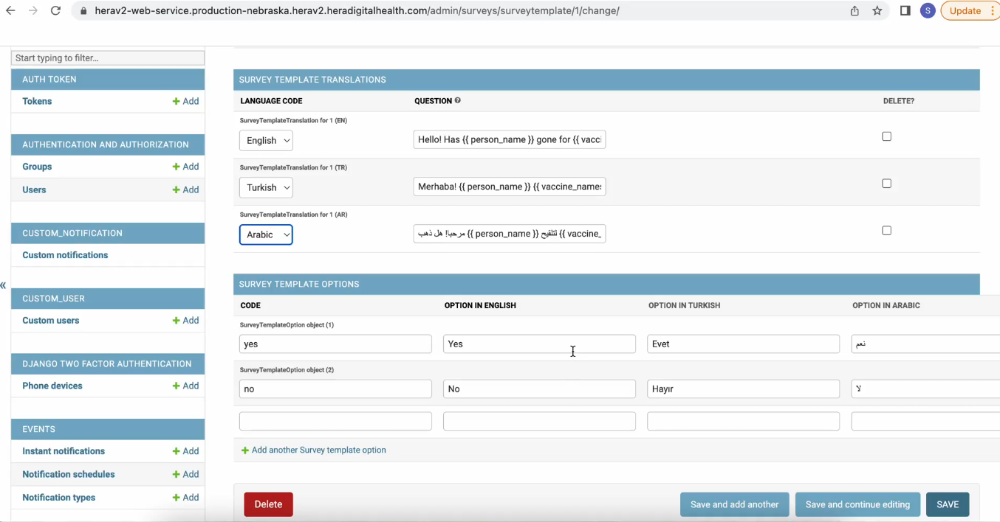
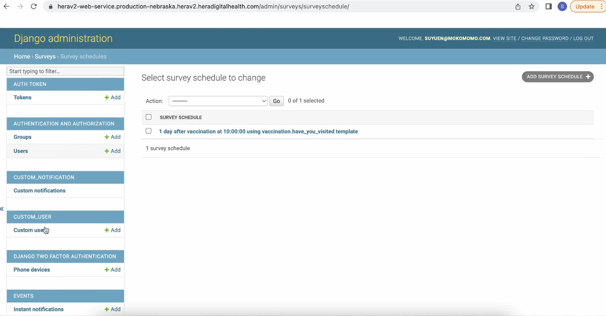
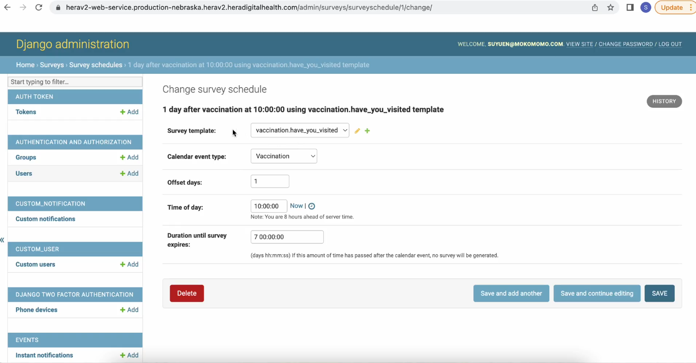
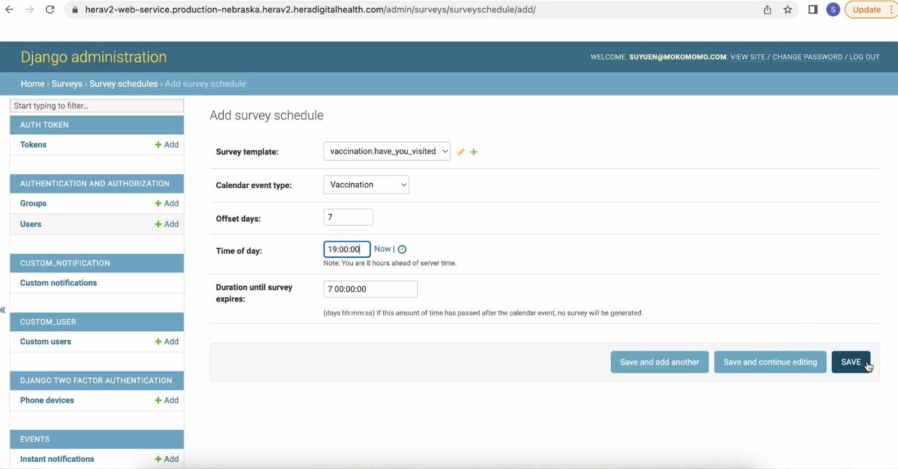
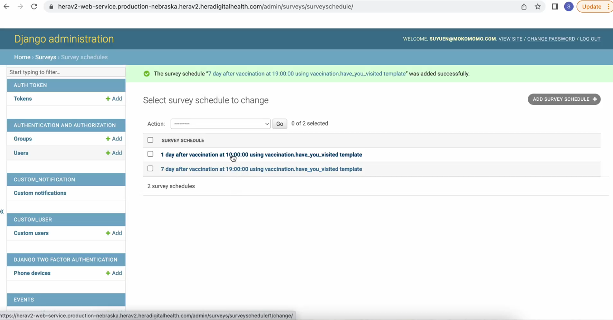
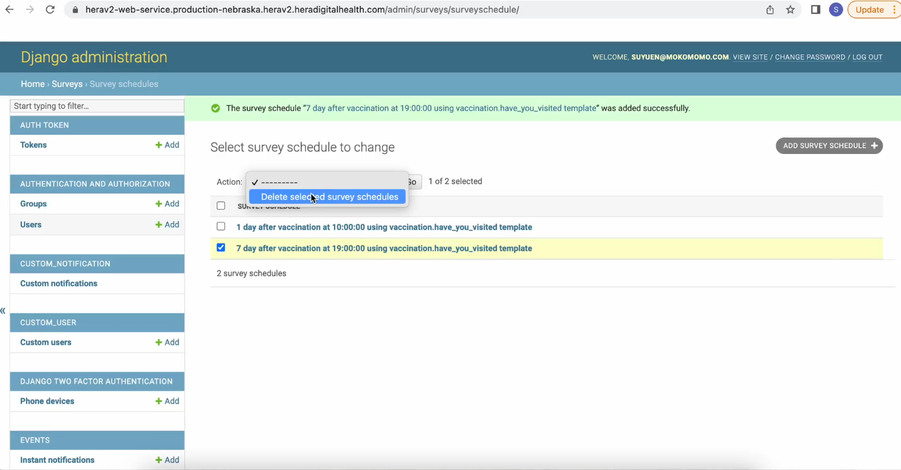
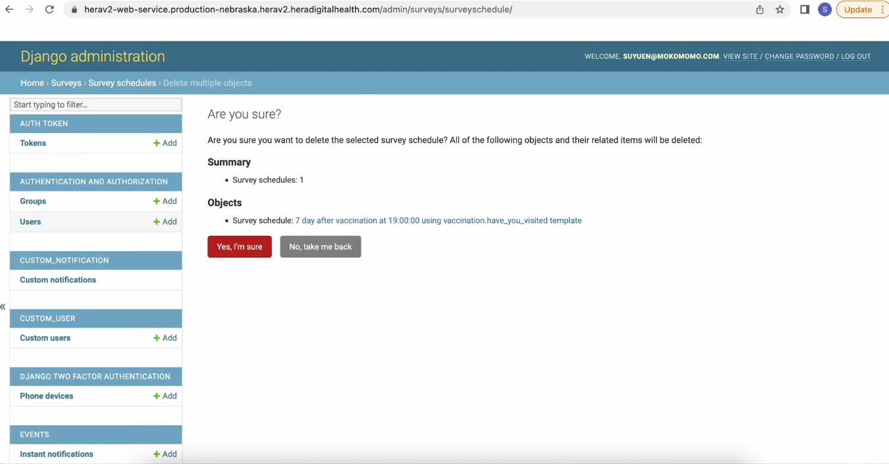

# 5: How to add, edit and delete notifications

### **Surveys**

#### Surveys are popup notifications that appear on the app after the recommended day of vaccination has passed. They can be accessed via the "Survey" tab on the left, which contains three options: Survey Schedules, Survey Templates, and Surveys.

#### The first step is to create a survey template.

#### One example of a survey template we have is "Vaccination: Have You Visited?" This template includes the following components:

- **Code (Name)**: A unique identifier for the survey. **Description**: A brief explanation of the survey's purpose. **Survey Type**: The category or type of survey. **Template Translation**: The survey content translated into various languages.

#### To create a new one

#### Setting up the languages and the answers which the user will select

#### Same with the notifications templates, you can set survey schedules for your template, this determines when the popup will appear on the app for the user, this time we set it to appear after what was scheduled for the vaccination appointment,

#### For this example, we set the survey to be sent one day after the scheduled appointment. The schedule includes the following details:

- **Survey Template**: Select the appropriate survey template to send to the user.

- **Calendar Event Type**: Choose the type of service (either vaccination or prenatal checkup).

- **Offset Days**: Specify the number of days after the scheduled appointment when the survey should be sent.

- **Time of Day**: Input the time of day when the survey is meant to be sent. This time will automatically synchronize with the user's time zone.

- **Duration Until Survey Expires**: Set the time period after which the survey will expire.

#### And confirm

