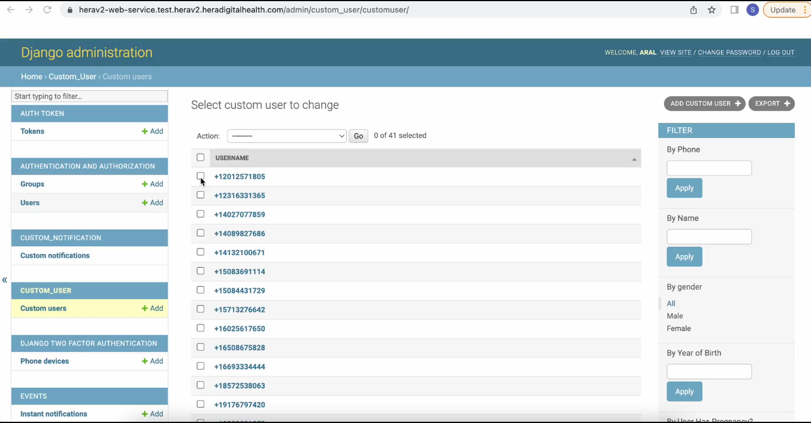
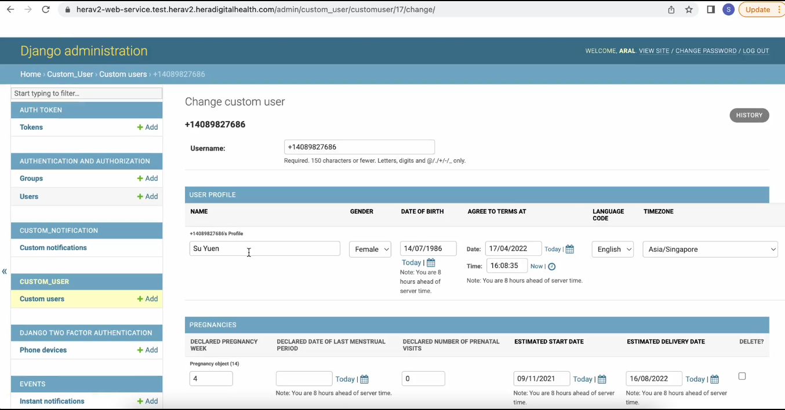
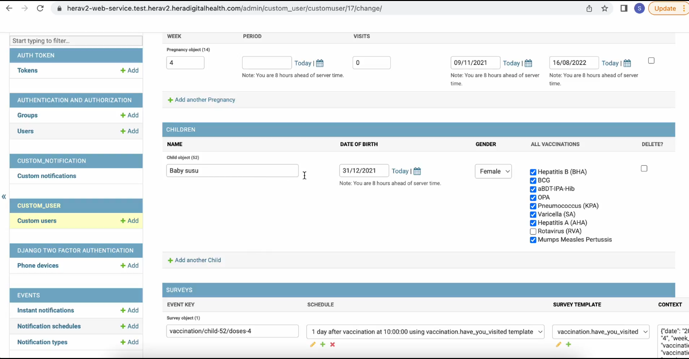
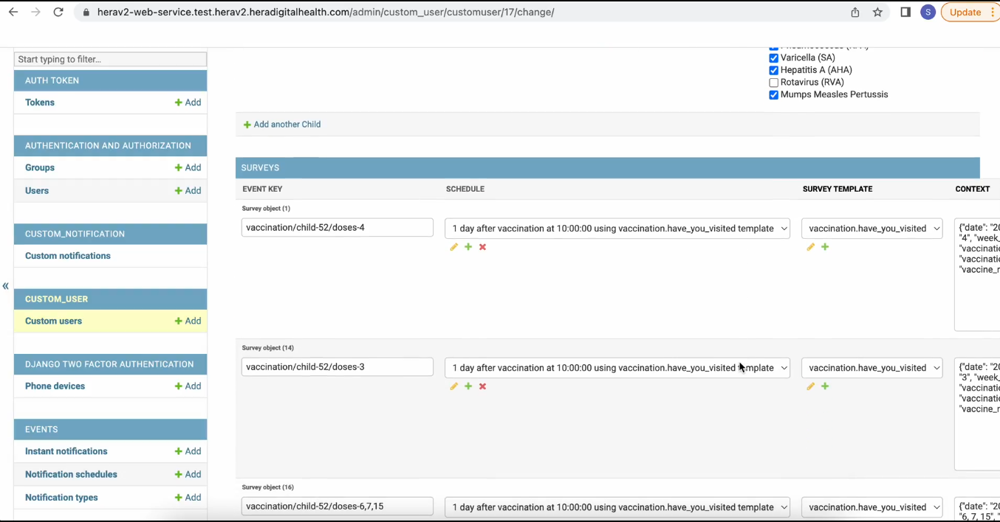
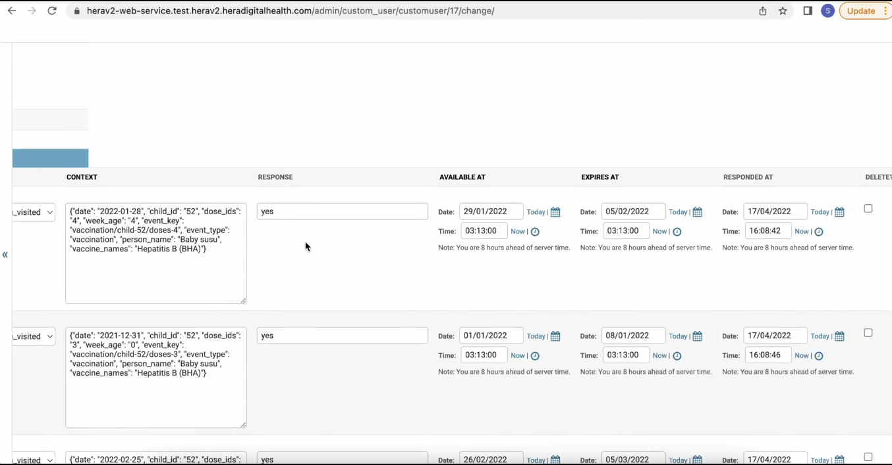
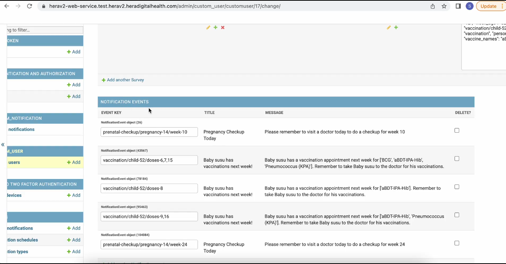
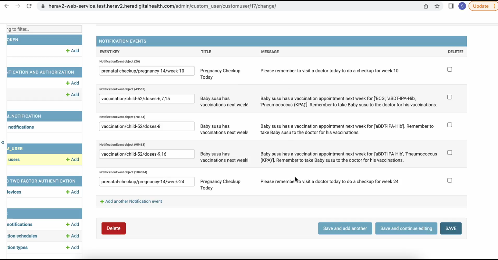

# 6: how to view individual data and responses

#### To view user data, navigate to the left-side tabs and select the "Custom User" tab. Click on "Custom Users" to display all user data from your application. You can filter the data by name, phone number, gender, year of birth, and whether the user has a pregnancy.

#### To access the data of a specific user, click on their phone number. A new page will open displaying all the details of the user, with the username being their phone number.

#### User Profile

- Name, Gender, Date of Birth, Date and Time of Terms Agreement, Language Code, Time Zone

#### Pregnancies

- Declared Week of Pregnancy, Declared Last Menstrual Period, Declared Prenatal Visits, Estimated Start Date (Conception Date), Estimated Delivery Date

### The Children Section

#### In this section, the user will see their children listed by name, date of birth, gender, and the vaccinations they have received. The user can mark each vaccination their child has received by ticking the corresponding box.

### The Survey section

#### This section displays all the surveys the user has received from the app. The surveys are grouped by the following details:

### Notification Events Sections

#### This section contains all the notification events sent to the user,

#### Grouped by event key, title and message

### Option to Delete user data

