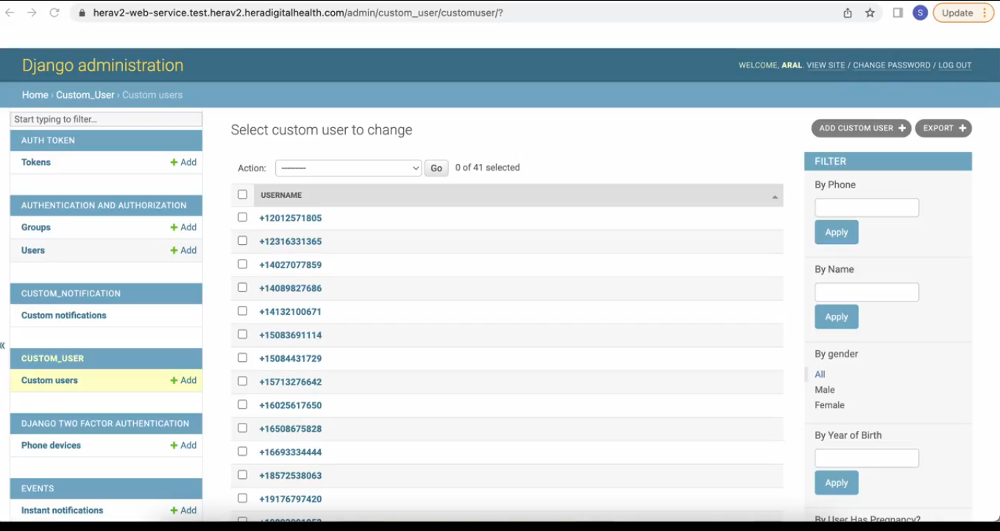
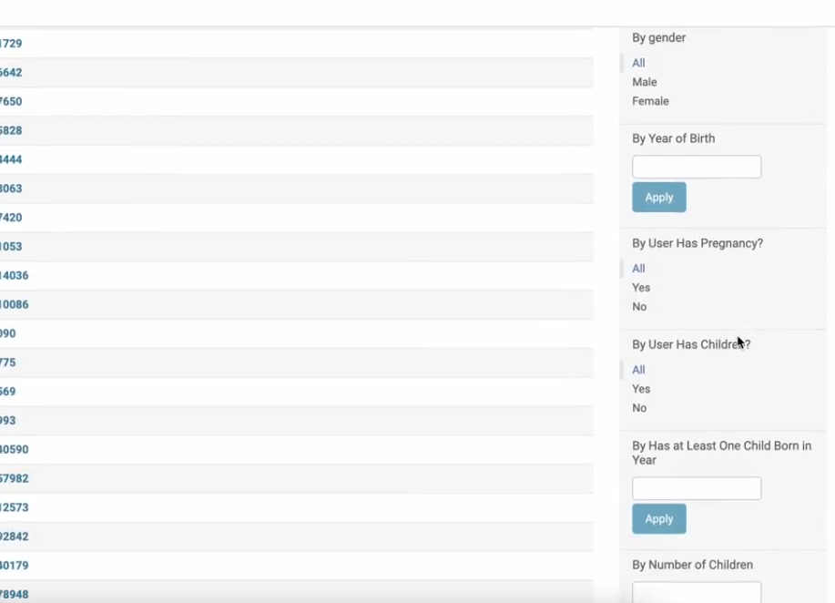
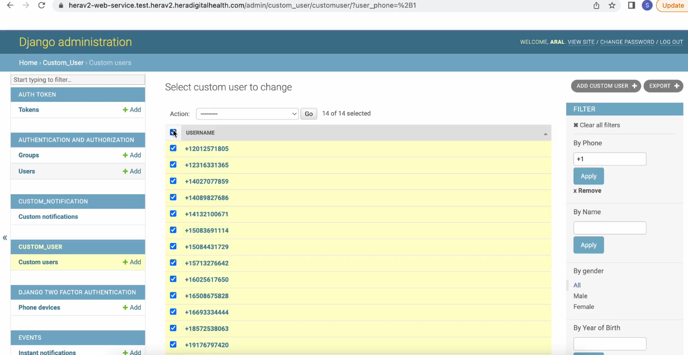
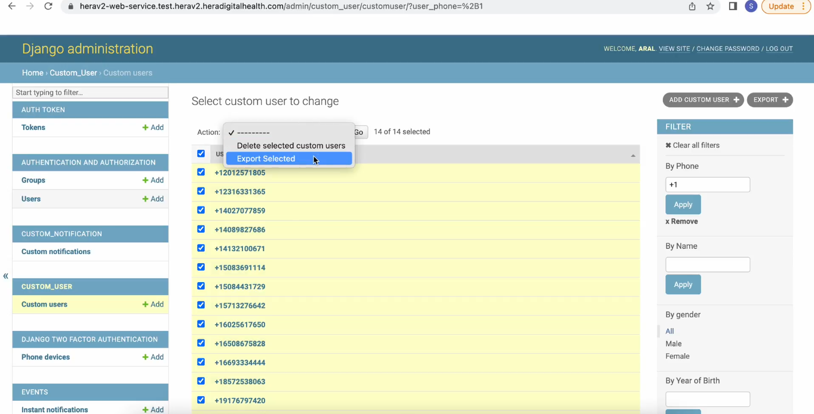
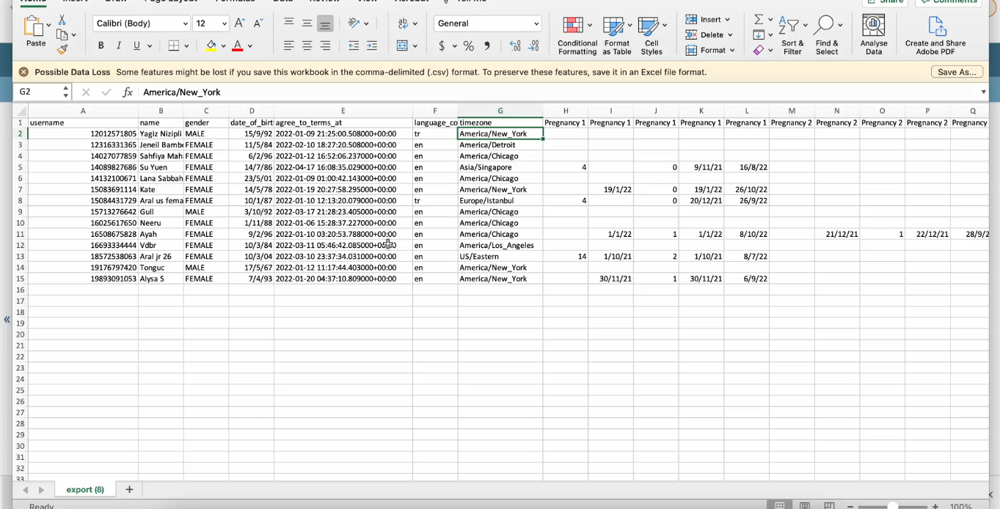
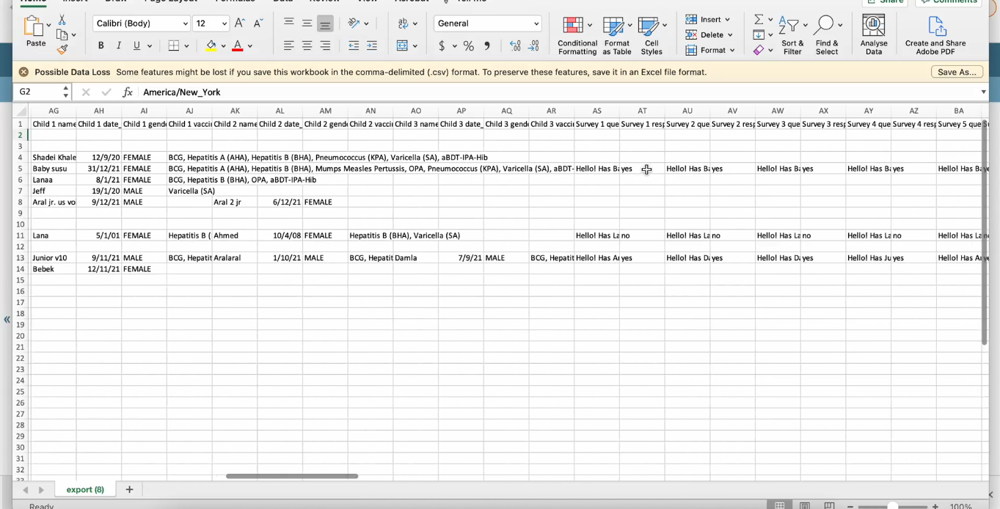
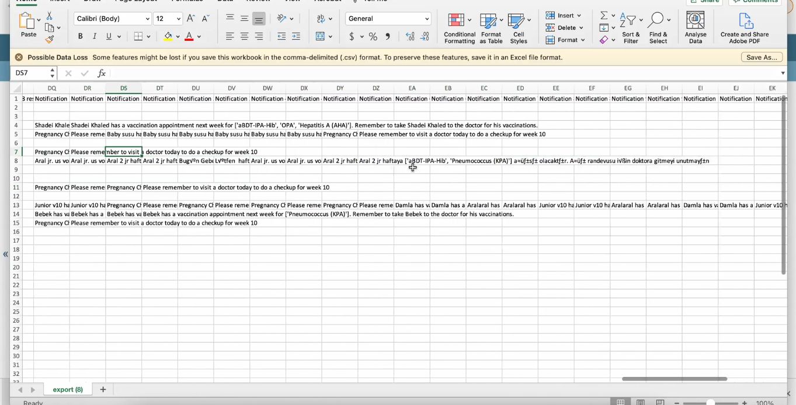

# 7: how to filter and export group user data

#### You also can filter all the data by groups

#### To access the Custom User interface:

1. Navigate to the left-hand side menu

2. Select the "Custom User Module"

#### **Filter Options (Located on the right-hand side, under the filter tabs): Demographics: **Phone, Name, Gender, Year of Birth **Family Information: **User is Expecting (Pregnancy), User Has a Child, Child Born in Specific Year, Number of Children **Survey Data: B**y Survey Answers **Communication **Notifications

#### **To Export Your Data:**

1. **Apply Filter Criteria:**

- Select your filter criteria. For example, filter by phone numbers starting with +1.

- Click **Apply** to activate the filter.

- **Select Data:**

- Use the checkboxes next to the numbers to select the data you want to export.

- Then On the actions select export and go

- A csv file will be generate

#### **Notes:**

- **Data Visibility:**

- Access to data depends on the user's permissions.

- Researchers will have personal information redacted.

- Admins will have access to all information.

- **CSV Export: \
  **The CSV file will contain all the data you selected for export.

- You can scroll through the CSV file to view the data.

- The exported data includes child details and survey answers.

#### **Up to and including all notifications sent**

