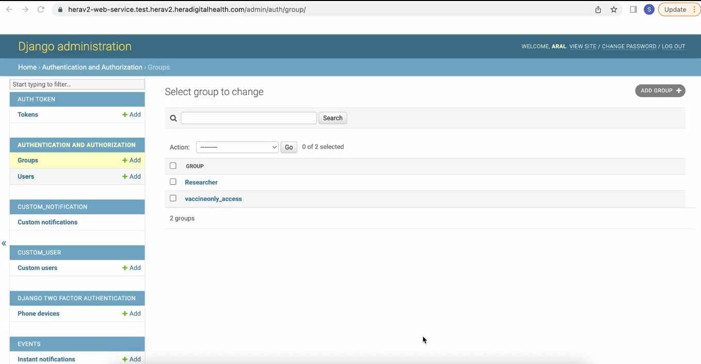

# 8: how to add researchers and give access to redacted data

#### Following **Guide 2 (How to Give Restricted Access to Users)**, you learnt how to create groups and users. In this guide, a group named "Researchers" with restricted access.

#### In this step, we will create a new user with specialized permissions. Follow these steps:

1. **Navigate to the Authentication and Authorization Module**:

- In the left-hand menu, click on "Users" under the "Authentication and Authorization" module.

- **Add a New User**:

- Click the "Add New User" button.

- **Enter User Details**:

- Input your preferred username and password.

- **Save**:

- Click the "Save" button to complete the process.

#### Assign the user to the "Researcher" group and set their staff status:

1. **Scroll Down**:

- Scroll down the page to reveal more options.

- **Set Staff Status**:

- Select the checkbox next to "Staff Status" to enable it.

- **Assign to Group**:

- In the "Groups" section, select the "Researcher" group from the list.

- Click the arrow button to transfer the "Researcher" group to the right, assigning the user to this group.

#### To assign custom user permissions

1. **Set User Permission**:

- In the "User Permission" section, type "custom" to filter the options.

- Select the "Can View Custom User" option.

- Click the arrow button to transfer the selected permission to the right, assigning it to the user.

- **Save Changes**:

- Click the "Save" button to apply and save the settings.

#### The new user has now been created. To test the user permissions, follow these steps:

1. **Log Out as Admin**:

- Log out of the current admin account.

- **Log In as the New User**:

- Log in using the credentials of the newly created researchUser

### The user will have restricted permissions as assigned. In this example, the user can only view custom users

#### Export the data by filtering it with your desired criteria. In this case, filter for numbers that start with "+1 (follow guide 7)

#### The exported CSV file will be generated, and the researcher will have access to redacted data. In this data, names and phone numbers will be blocked out (represented with xxxxx) to ensure client privacy.

#### Also the names of the children

