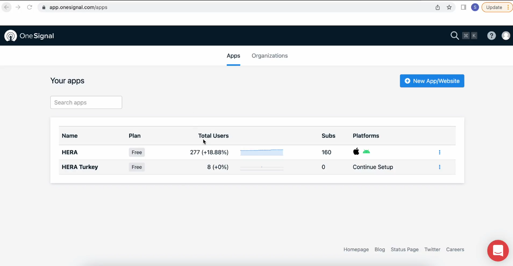
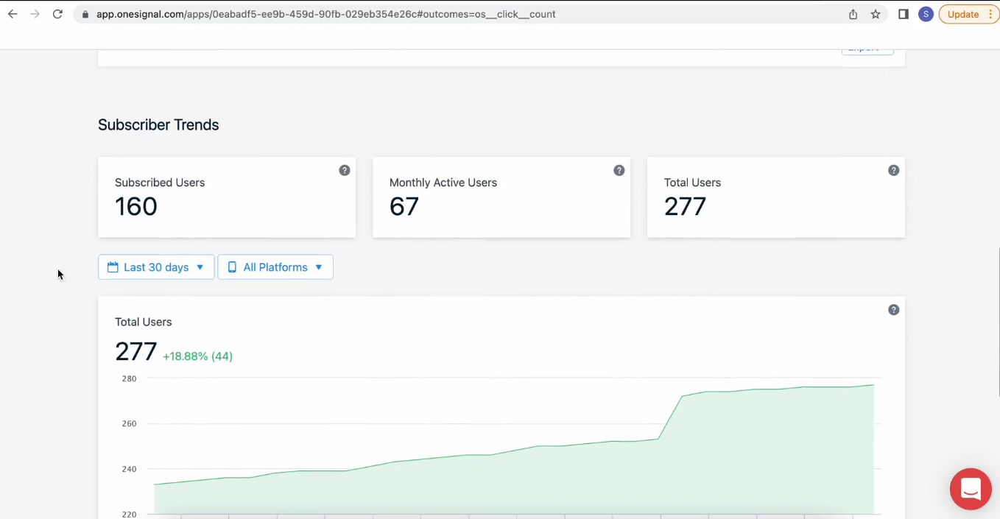
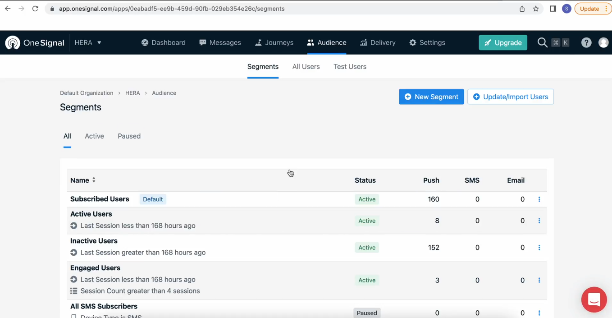
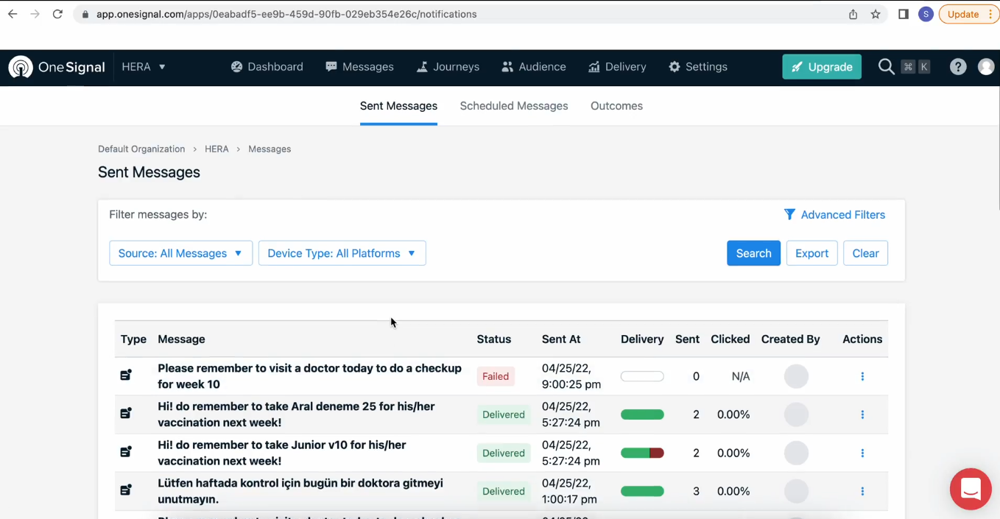

# 9: how to get push notification data from Onesignal

#### OneSignal is a leading platform designed to streamline and enhance your communication strategies through a variety of messaging channels. Can be used to engage your audience, boost user retention, or drive conversions using tools such as push notifications, sms, emails and in-app messaging

#### The platform offers comprehensive user analytics, providing essential metrics such as the total number of users signed up and active user counts, along with real-time insights and custom reporting

#### In the audience menu, gain a detailed overview of your user segments, including active and inactive users, engaged users, and those subscribed to SMS and email communications.

The delivery menu displays all push notifications sent to your users, providing the following information:

- [object Object][object Object]Message: [object Object][object Object]The message that was sent to the user

- [object Object][object Object]Delivery Status[object Object][object Object]: Whether the notification was delivered or not.

- [object Object][object Object]Timestamp[object Object][object Object]: The exact time it was sent.

- [object Object][object Object]User Interaction[object Object][object Object]: If the user clicked on the message and interacted with it.

#### The menu also offers filtering and exporting options, enabling you to track the performance of your push notifications effectively.

